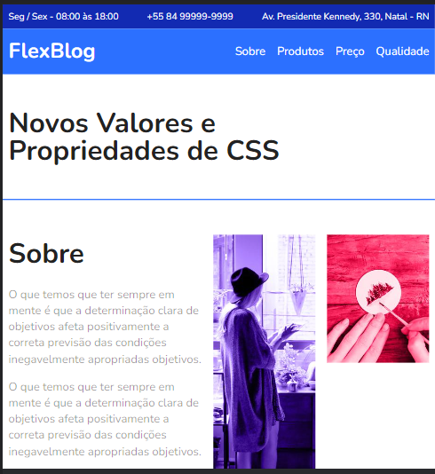

# Curso de CSS FLEXBOX

## Lições aprendidas:

#### Flex Container:

- Display
- Flex-direction
- Flex-wrap
- Flex-flow
- Justify-content
- Align-items
- Align-content

#### Flex Item:

- Flex-grow
- Flex-basis
- Flex-shrink
- Flex
- Order
- Align-self

https://luizaraujo18.github.io/projeto-flex_blog/

  
  
 
  
  
  
  
 

Origamid © 2012 - 2017. Alguns direitos reservados.
